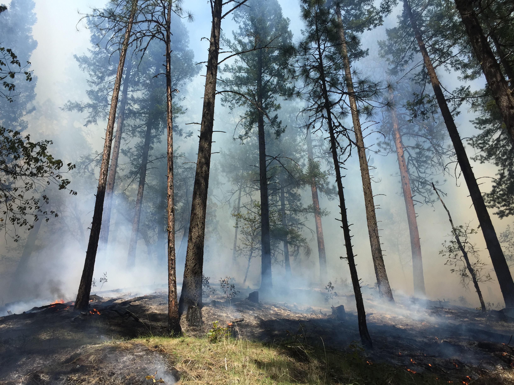

+++
# A Demo section created with the Blank widget.
# Any elements can be added in the body: https://sourcethemes.com/academic/docs/writing-markdown-latex/
# Add more sections by duplicating this file and customizing to your requirements.

widget = "blank"  # See https://sourcethemes.com/academic/docs/page-builder/
headless = true  # This file represents a page section.
active = true # Activate this widget? true/false
weight = 20  # Order that this section will appear.

title = ""
subtitle = ""

[design]
  # Choose how many columns the section has. Valid values: 1 or 2.
  columns = "1"

[design.background]
  # Apply a background color, gradient, or image.
  #   Uncomment (by removing `#`) an option to apply it.
  #   Choose a light or dark text color by setting `text_color_light`.
  #   Any HTML color name or Hex value is valid.

  # Background color.
  # color = "navy"
  
  # Background gradient.
  # gradient_start = "DeepSkyBlue"
  # gradient_end = "SkyBlue"
  
  # Background image.
  image = ""  # Name of image in `static/img/`.
  image_darken = 0.6  # Darken the image? Range 0-1 where 0 is transparent and 1 is opaque.

  # Text color (true=light or false=dark).
  text_color_light = false

[design.spacing]
  # Customize the section spacing. Order is top, right, bottom, left.
  padding = ["20px", "0", "20px", "0"]

[advanced]
 # Custom CSS. 
 css_style = ""
 
 # CSS class.
 css_class = "mini"
+++

I received my PhD in forest ecosystems and society from Oregon State University in 2019. Currently, I am a Post-doctoral research and teaching fellow at Colgate University.

My research focuses on landscape scale disturbances. I am a postdoctoral research and teaching fellow at Colgate Univeristy. My current research focuses using remote sensing applications to evaluate the extent and effects of wildfire across northeastern Siberia, Russia. My PhD research focused on overlapping disturbances of mountain pine beetle outbreak and wildfire in British Columbia, Canada. In my free time, I can be found trail running, hiking, and training for triathlons, outside time is the best time.

I am an avid user of the statistical programming language R, Google Earth Engine, and ArcGIS. I developed a passion for programming and education, and have taught satellite image analysis with Google Earth Engine while at [Colgate University](https://colgate.edu).

I have worked extensively as an outdoor educator with [NOLS](https://nols.edu) and [Outward Bound](https://www.hiobs.org/). I integrate placed based and experiential learning into my classrooms.

