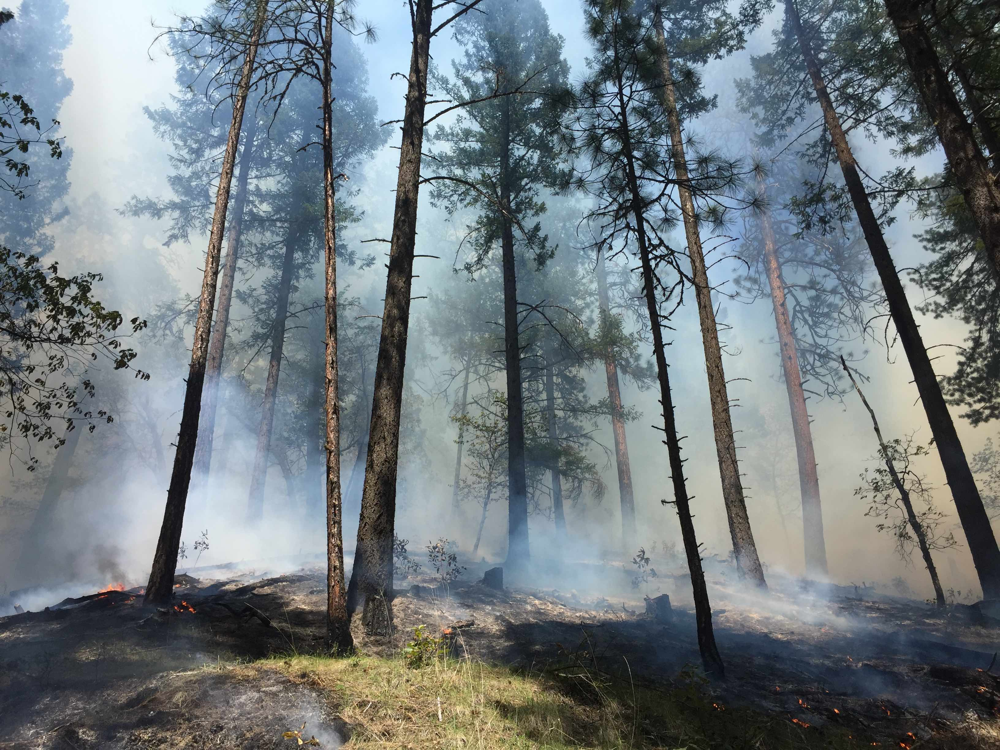

+++
# A Demo section created with the Blank widget.
# Any elements can be added in the body: https://sourcethemes.com/academic/docs/writing-markdown-latex/
# Add more sections by duplicating this file and customizing to your requirements.

widget = "blank"  # See https://sourcethemes.com/academic/docs/page-builder/
headless = true  # This file represents a page section.
active = true # Activate this widget? true/false
weight = 20  # Order that this section will appear.

title = ""
subtitle = ""

[design]
  # Choose how many columns the section has. Valid values: 1 or 2.
  columns = "1"

[design.background]
  # Apply a background color, gradient, or image.
  #   Uncomment (by removing `#`) an option to apply it.
  #   Choose a light or dark text color by setting `text_color_light`.
  #   Any HTML color name or Hex value is valid.

  # Background color.
  # color = "navy"
  
  # Background gradient.
  # gradient_start = "DeepSkyBlue"
  # gradient_end = "SkyBlue"
  
  # Background image.
  image = ""  # Name of image in `static/img/`.
  image_darken = 0.6  # Darken the image? Range 0-1 where 0 is transparent and 1 is opaque.

  # Text color (true=light or false=dark).
  text_color_light = false

[design.spacing]
  # Customize the section spacing. Order is top, right, bottom, left.
  padding = ["20px", "0", "20px", "0"]

[advanced]
 # Custom CSS. 
 css_style = ""
 
 # CSS class.
 css_class = "mini"
+++

My research is focused on landscape-scale disturbances and the nuances of disturbance regimes under changing climate. I use a variety of geospatial techniques to characterize and understand patterns that unfold across landscapes and the biotic and abiotic processes that drive them.

Currently, I am working on mapping and characterizing wildfire across northeastern Siberia. This research harnesses the advances in computing and geospatial technology by using the cloud computing of [Google Earth Engine](https://earthengine.google.com/). We are using the [Landsat](https://landsat.gsfc.nasa.gov/) satellite imagery to map and characterize area burned and fire severity. We are also using Unmanned Aerial Vehicles (UAVs) to look at fine-scale measures of [vegetation indices](https://www.usgs.gov/land-resources/eros/phenology/science/vegetation-indices#:~:text=On%20the%20Ground-,Vegetation%20Indices,and%20reflected%20by%20green%20plants.&text=The%20leaves%20themselves%20strongly%20reflect,is%20invisible%20to%20human%20eyes.) to examine edge effects and plant assemblages.

My Ph.D. research focused on short-interval disturbances where substantial tree mortality from mountain pine beetle outbreaks are followed in short succession by wildfire in central interior British Columbia, Canada. This research uses both field data and satellite image analysis. We found that forest with substantial tree mortality burns differently, while also having a substantial seedbank for lodgepole pine regeneration.

I am an avid user of the [statistical programming language R](https://www.r-project.org/), [Google Earth Engine](https://earthengine.google.com/), and ArcGIS. I have taught satellite image analysis and introduction to GIS. I am excited to work with undergraduate students interested in using satellite imagery to ask and answer spatial-temporal research questions.

I have worked extensively as an outdoor educator with [NOLS](https://nols.edu) and [Outward Bound](https://www.hiobs.org/). I integrate placed based and experiential learning into my classrooms. I incorporate sound risk management practices in my fieldwork campaigns.